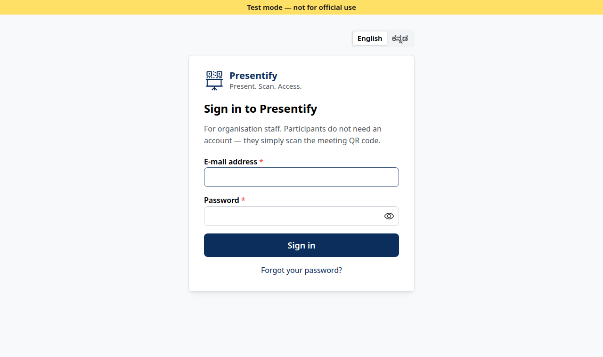
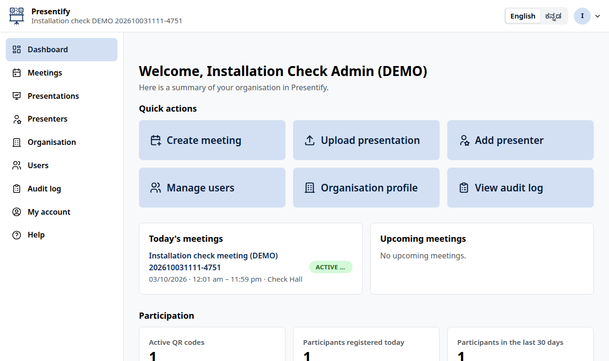
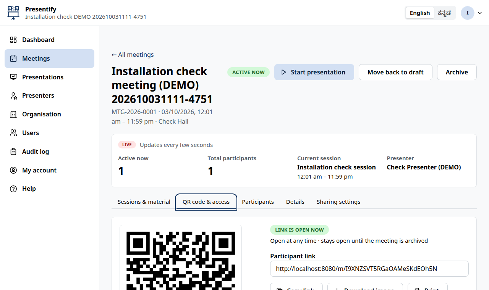
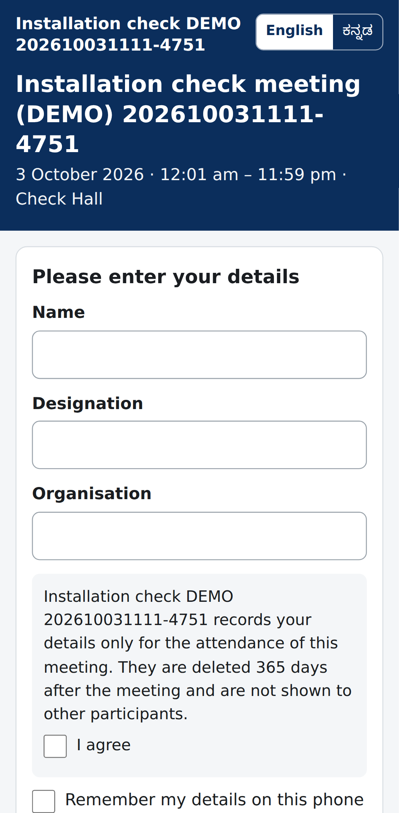

# Presentify

**Present. Scan. Access.** — One Presentation. One QR Code. Zero Unnecessary Paper.

Presentify is a digital presentation-sharing, meeting-attendance and document-distribution platform for organisations,
training institutions, government offices and corporate meetings. Participants scan one QR code, enter their details and
view the presentation and supporting material on their own phone — no printed handouts, no app installation.

> **Status: Phases 1–4 of 6 complete** — organisations, staff accounts, sign-in with MFA, limits, audit,
> English/ಕನ್ನಡ; meetings with sessions and presenters, presentation uploads with versions, PDF copies and
> supporting material; QR codes, participant registration, the phone PDF viewer, download control, attendance and
> data retention; the create-meeting wizard, QR display mode, presenter mode and live participant count.
> Reports: [Phase 1](docs/PHASE-1-REPORT.md) · [Phase 2](docs/PHASE-2-REPORT.md) · [Phase 3](docs/PHASE-3-REPORT.md)
> · [Phase 4](docs/PHASE-4-REPORT.md).

## Install (one command)

**You need:** Windows 11 (16 GB RAM recommended, 30 GB free disk) with
[Docker Desktop](https://www.docker.com/products/docker-desktop/) installed and showing *"Engine running"*.

1. On this page choose **Code → Download ZIP** and extract it to `C:\Presentify`
   (or `git clone https://github.com/rajmanasu-a11y/Presentify.git C:\Presentify`).
2. Connect the laptop to the Wi-Fi or **mobile hotspot** the phones will use.
3. Double-click **`install.cmd`** in `C:\Presentify`.
   It checks Docker, creates the private settings file `.env`, builds and starts Presentify
   (first time 10–20 minutes), asks for the **first Super Admin**'s e-mail and name, shows a **temporary password**,
   and opens the browser. Running it again later is safe: it starts Presentify and never deletes data.

Linux / State Data Centre server: `./install.sh` (or `./install.sh --public-url https://presentify.example.gov.in`).
Full step-by-step guide with troubleshooting: [docs/INSTALL-LAPTOP-WINDOWS.md](docs/INSTALL-LAPTOP-WINDOWS.md).

## Open Presentify (the screens)

| Who | Opens | Address |
|---|---|---|
| You, on the laptop | the browser | **<http://localhost:8080>** |
| Staff on other computers, or your phone | the browser, on the same Wi-Fi/hotspot | **`http://<laptop address>:8080`** — shown at the end of the installer (it is `PUBLIC_URL` in `.env`) |
| Participants | **nothing to type** — they scan the meeting's QR code with the phone camera | the QR code contains `http://<laptop address>:8080/m/<code>` |
| Projector / hall TV | meeting page → **QR code & access → Show full screen**, or **Start presentation** | opens in a new browser tab |

<p>


</p>
<p>


</p>

**First steps after installing**

1. Open <http://localhost:8080> and sign in as the **Super Admin** with the temporary password from the installer.
   Choose your own password, then scan the on-screen code with an authenticator app (Google or Microsoft
   Authenticator) and type the 6-digit code.
2. **Organisations → New organisation**, then **Add user → Organisation Admin**. A temporary password is shown once.
3. Sign out, and sign in as that **Organisation Admin** (choose a new password).
4. **Create meeting** — the wizard guides you through sessions, presentations, access settings and the QR code.
5. Show the QR code; participants scan it with their phones.

**If a screen does not open:** run `docker compose ps` in `C:\Presentify` (all services should be *healthy*;
`migrate` shows *exited (0)*), or simply double-click `install.cmd` again. If phones cannot open it, use a mobile
hotspot and check the address — see *Using phones* in the installation guide.

## Technology

Self-hosted Supabase (PostgreSQL 17 with Row-Level Security, Auth, Storage, Edge Functions) ·
React + TypeScript + Mantine · nginx gateway · Docker Compose. Details:
[docs/ARCHITECTURE.md](docs/ARCHITECTURE.md).

## Documents

| Document | Contents |
|---|---|
| [docs/01-FINAL-REQUIREMENTS.md](docs/01-FINAL-REQUIREMENTS.md) | Confirmed requirements specification |
| [docs/00-DISCOVERY.md](docs/00-DISCOVERY.md) | Original analysis, questions, ER diagram |
| [docs/ARCHITECTURE.md](docs/ARCHITECTURE.md) | Services, data model, security model |
| [docs/INSTALL-LAPTOP-WINDOWS.md](docs/INSTALL-LAPTOP-WINDOWS.md) | Laptop installation (Windows 11) |
| [docs/TESTING-GUIDE.md](docs/TESTING-GUIDE.md) | **Testing guide**: prerequisites, automated tests, installation check, manual checklist |
| [docs/TESTING.md](docs/TESTING.md) | What the automated tests cover |
| [docs/TEST-REPORT-2026-10-03.md](docs/TEST-REPORT-2026-10-03.md) | Latest thorough test run and findings |
| [docs/PHASE-1-REPORT.md](docs/PHASE-1-REPORT.md) | Phase 1 delivery, test results, checklist |
| [docs/PHASE-2-REPORT.md](docs/PHASE-2-REPORT.md) | Phase 2 delivery, test results, checklist |
| [docs/PHASE-3-REPORT.md](docs/PHASE-3-REPORT.md) | Phase 3 delivery, test results, load check, checklist |
| [docs/PHASE-4-REPORT.md](docs/PHASE-4-REPORT.md) | Phase 4 delivery, test results, checklist |

## Tests

```bash
scripts/test.sh        # disposable test stack on port 8090: 134 API/security + 30 browser tests
```
