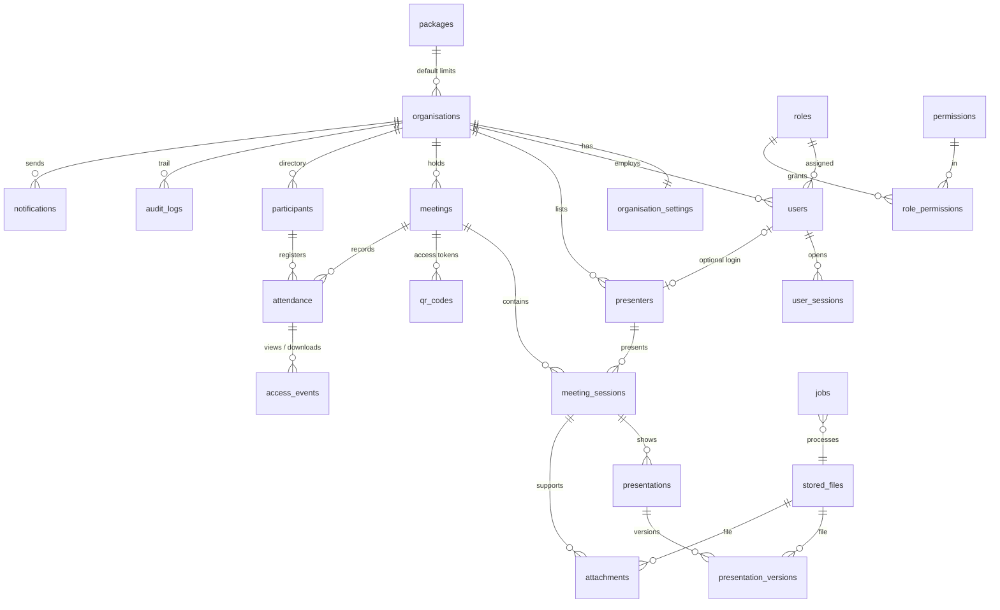

# Presentify — Discovery, Clarifications & Proposed Design

> **Status:** historical. Questions answered. **[01-FINAL-REQUIREMENTS.md](01-FINAL-REQUIREMENTS.md) supersedes this document** wherever they differ — in particular the hosting decision changed to **self-hosted Supabase**, which replaces the architecture (§3), parts of the database design (§5: users/sessions are handled by Supabase Auth), the security implementation details (§6) and the deployment model (§7) described here.
> **Tagline (proposed):** *Present. Scan. Access.* — "One Presentation. One QR Code. Zero Unnecessary Paper."

---

## 0. Inputs reviewed

| Input | Finding | Consequence |
|---|---|---|
| `…storage.zip` | **Empty archive** (22 bytes, zero entries). | No earlier source code was received. If you intended to share code, please re-upload. |
| `…db_cluster-23-07-2025….backup.gz` | Supabase cluster dump. App schema = 4 tables: `profiles`, `presentations` (pdf/pptx/html), `user_notes`, `presentation_views`. Data: 1 profile, **0 presentations, 0 stored files**. | Nothing to migrate. Lessons taken (below). The dump contains a password hash, so it will **not** be committed to the repository. |

**Lessons from the earlier Presentify (Supabase) version**

1. The storage bucket was public (`Anyone can view presentation files`) — download control and access modes were impossible. Presentify v2 serves every file through an authorising endpoint.
2. `Everyone can view presentations` RLS policy — no tenant isolation, no meeting scoping.
3. Single `admin`/`user` role, open sign-up trigger — no organisations, no RBAC.
4. Participants had to be authenticated users — contrary to "no account needed".
5. No meeting/session concept, no attendance, no versions, no audit.

---

## 1. Analysis — ambiguities, contradictions and technical limitations

| # | Issue | Why it matters | Proposed resolution |
|---|---|---|---|
| A1 | **Access Mode 1 "Open link" vs attendance.** If nobody registers, there is no attendance. | Reports would show only anonymous counts. | Treat access as *combinable settings* (see §2 Q9). Open mode records anonymous view counts only, and the UI says so. |
| A2 | **"QR per meeting" vs "QR per presentation".** Both are mentioned. | Determines what participants scan and what gets revoked. | One **meeting QR** is primary. A presentation always lives inside a meeting session; a "quick single presentation" is simply a one-session meeting. |
| A3 | **Download OFF ≠ protection.** To *view* a file, the browser must receive it. | Must not imply DRM. | No download buttons, `inline` disposition, PDF.js viewer with download/print hidden, optional name watermark overlay, and an explicit notice: *"Viewing in a browser cannot prevent screenshots or photographs."* |
| A4 | **PowerPoint preview.** Browsers cannot render .pptx natively. Microsoft's online viewer needs a public URL **and sends the file to Microsoft** — unsuitable for government content and impossible on LAN. | Directly affects the core feature. | Server-side **LibreOffice** converts a *copy* to PDF for preview; the original is preserved untouched. Fidelity caveats: animations/transitions and some fonts will not be reproduced. (Q5) |
| A5 | **Mode 5 OTP** needs SMS/e-mail delivery, but external messaging must not be implemented unless configured. | OTP cannot work without a gateway. | v1: meeting **passcode**; e-mail OTP only if SMTP is configured; SMS OTP only when a provider is supplied. (Q9) |
| A6 | **LAN mode + HTTPS + phones.** Phones reject self-signed certificates; phones on mobile data cannot reach a LAN server. | Participants on LAN would see security warnings or nothing. | LAN deployments need venue Wi-Fi that reaches the server **and** a trusted certificate (a real domain with split-DNS and a DNS-validated certificate, or an internal CA installed on devices — not practical for visitors). Documented explicitly. (Q19) |
| A7 | **"Already registered?"** — looking someone up by mobile number without verification would expose personal data to anyone who types a number. | Privacy breach. | Opt-in "Remember me on this device" (opaque random token, no personal data on the phone). No lookup-by-mobile without OTP. (Q6) |
| A8 | **Organisation hierarchy.** Examples mix a parent ("Karnataka State Police") and a unit ("Police Computer Wing"). | Defines tenant boundaries and who sees what. | Flat tenants by default. (Q1) |
| A9 | **Presenters as accounts.** Guest presenters (external officers) often need no login. | Account sprawl vs capability. | Presenter = directory record; optionally linked to a login. (Q3) |
| A10 | **Status lifecycle.** Active/Completed can be derived from time; manual changes can conflict with access rules. | Access decisions depend on status. | Draft → Published (Scheduled/Active/Completed shown automatically from times) → Archived. Admin can end early or extend. |
| A11 | **Retention vs audit trail.** Deleting participant data must not break audit integrity. | Legal + integrity. | Audit logs store participant *reference*, not personal data. Retention anonymises personal fields, keeps counts. |
| A12 | **IP/device capture** is personal data under India's DPDP Act 2023 (assumed applicable law). | Consent notice, purpose limitation. | Store for security purposes only, disclosed in the notice, short retention. (Q14) |
| A13 | **Video streaming at scale.** 300 phones streaming a 200 MB video over venue Wi-Fi will saturate it. | Venue experience. | Videos off by default, range-request streaming, per-org size limit, warning shown to admin. |
| A14 | **Recommended stack (Next.js + FastAPI)** means two languages and two servers. | More toolchains to maintain; validation rules duplicated between UI and API. | Recommend TypeScript end-to-end with React (see §3). (Q18) |
| A15 | **Organisation expiry** behaviour is undefined. | Live meetings could break mid-session. | Grace period proposal. (Q24) |

---

## 2. Clarification questions

Each question has a **proposed default**. You may answer *"accept all defaults"* and only list exceptions.
Questions marked **★ needs your answer** have no safe default.

### 2.1 Organisation & Administration

**Q1. Tenant structure — flat or hierarchical?**
*Why:* decides isolation boundaries and whether a parent can see units' reports.
**Default:** flat organisations (each fully isolated). Inside an organisation, an optional "Unit/Branch" label on meetings for filtering. Parent-child roll-up reporting deferred.

**Q2. Can one user belong to more than one organisation?**
*Why:* affects login, session scoping and isolation tests.
**Default:** no — one user, one organisation (e-mail unique system-wide). Super Admins belong to no organisation.

### 2.2 Presentation & Meeting

**Q3. Presenters — accounts or directory entries?**
*Why:* guest presenters rarely need a login.
**Default:** Presenter is a directory record (name, designation, organisation, photo optional). An admin can *invite* a presenter to log in; only then can they upload/replace their own material.

**Q4. Which session content can participants see, and when?**
*Why:* some presenters do not want slides visible before they speak.
**Default:** per-meeting setting — *"Show all sessions immediately"* (default) or *"Release each session when it starts"* (upcoming sessions shown as "Available from 11:30"). Completed sessions stay available.

**Q5. PowerPoint/Word/Excel preview method.**
*Why:* see A4 (privacy and LAN compatibility).
**Default:** server-side LibreOffice conversion to a PDF preview copy (works offline/LAN, no third party). Adds ~600 MB to the deployment and ~1 GB RAM during conversion. Alternative: no Office preview (open/download only).

### 2.3 Participant / Visitor

**Q6. Returning participants and the participant directory.**
*Why:* convenience vs privacy (A7).
**Default:**
- Opt-in "Remember me on this device" (random token cookie, 90 days) — prefills details on the next meeting of the **same organisation** only.
- Organisation setting *"Keep a participant directory"* (default **on**): repeat registrations are linked when mobile or e-mail matches; otherwise each registration stands alone. Never auto-merged by name.

**Q7. One registration per meeting, covering all sessions?**
*Why:* "unified attendance" in the spec.
**Default:** yes — one registration per participant per meeting; per-session presence is derived from which session content they opened and when they registered. Optional per-session "check-in" deferred.

### 2.4 QR Code

**Q8. How long does the meeting link work after the meeting ends?**
*Why:* participants often want material later; organisations may want it closed.
**Default:** meeting end + **7 days** (configurable: 0 days / 7 / 30 / 90 / until archived). After that: *"This meeting has ended. Please contact the organiser."*
Regenerating a QR **revokes the old one immediately** (with a warning that printed copies stop working).

### 2.5 Download & Access Control

**Q9. Access modes as combinable settings — acceptable?**
*Why:* the five modes overlap (A1, A5).
**Default:** each meeting has three independent settings:

| Setting | Options |
|---|---|
| Registration | Required (default) · Optional · Not required (anonymous counts only) |
| Availability | Meeting time ± grace (default: 30 min before → Q8 after) · Custom window · Always |
| Protection | None (default) · Meeting passcode · E-mail OTP (only if SMTP configured) |

SMS OTP: **★ only if you name a provider** (otherwise not built in v1).

**Q10. Download control granularity and watermark.**
*Why:* a handout may be downloadable while the main deck is not.
**Default:** meeting-level switch with per-file override. When downloads are OFF, the viewer shows a light overlay watermark *"Participant name · date/time"* (organisation can turn it off).

### 2.6 Reports

**Q11. Official report format requirements?**
*Why:* government reports often need letterhead/signature blocks.
**Default:** header with organisation logo, name and report title; filter summary; generated-by and timestamp; page X of Y; optional signature line. Access counts shown as both *unique participants* and *total opens*.

### 2.7 Security & Privacy

**Q12. Multi-factor authentication.**
**Default:** TOTP authenticator app **mandatory** for Super Admins; optional for other users, which an organisation can make mandatory for its admins.

**Q13. Super Admin access path.**
**Default:** separate console at a non-advertised path (or separate host name), not linked from the landing page, MFA required, optional IP allow-list.

**Q14. IP address and device capture.**
*Why:* personal data (A12).
**Default:** IP + browser/device summary recorded in access and audit logs for security only, disclosed in the consent notice, kept **90 days** then removed. Not shown in normal attendance reports.

**Q15. Default participant data retention.**
**Default:** organisation chooses 30 / 90 / 180 / **365 (default)** days / indefinite. On expiry, personal fields are anonymised; counts remain in reports. Assumption: India's **DPDP Act 2023** is the governing privacy law — please confirm or name another.

**Q16. Malware scanning.**
**Default:** ClamAV scan on every upload (files quarantined until clean) — enabled by default; can be disabled on small LAN servers (needs ~1.5 GB RAM).

### 2.8 Hosting / Deployment

**Q17. Where does Presentify's code live?** — *Decided:* its own repository, `rajmanasu-a11y/Presentify`. It shares no code, database or configuration with any other application.

**Q18. Technology stack** — see §3. **Default:** Node.js + TypeScript backend, React + Vite admin UI, server-rendered participant pages, PostgreSQL. Say if you prefer Next.js + FastAPI (Python) instead.

**Q19. ★ First deployment target and domain.**
*Why:* TLS, LAN reachability (A6), storage choice.
Options: hosted VPS/cloud · NIC / State Data Centre · on-premise LAN server. Please give the intended domain name (e.g. `presentify.example.in`) if known.
**Default for development/demo:** Docker Compose on a Linux VM with Let's Encrypt.

**Q20. Expected scale.**
**Default sizing:** up to 50 organisations, 500 participants scanning one QR within ~2 minutes, 20 meetings live simultaneously, 1 TB of files, single files ≤ 100 MB (video ≤ 500 MB when enabled).

### 2.9 Branding

**Q21. Name, tagline, colours.**
**Default:** *Presentify* with the uploaded QR-screen logo; navy primary (taken from the logo) + one accent; tagline **"Present. Scan. Access."**
Alternatives: "Scan. Register. View." · "One QR. Every Document." · "Paperless Meetings, Simply Shared."

**Q22. Languages in version 1.**
**Default:** English only, but every user-facing text goes through a translation catalogue so Kannada/Hindi can be added without code changes. If Kannada is needed on the **participant page** in v1, say so (fonts and PDFs must then include Noto Sans Kannada).

### 2.10 Database

**Q23. Start fresh?**
**Default:** yes — the earlier Supabase database contains no presentations or files; no migration. PostgreSQL 16+ self-managed (not Supabase), so the same setup works on LAN.

### 2.11 Subscription / Limits

**Q24. What happens when an organisation expires or hits a limit?**
**Default:**
- Expiry: 15-day grace (banner for admins, everything works) → then admins read-only, public links show *"Temporarily unavailable"*; data kept until the Super Admin deletes it.
- Limits: storage counts originals + all versions (not generated previews); the presentation limit counts non-deleted presentations (archived included); when participant limit per meeting is reached, registration shows *"This meeting has reached its participant limit."* Enforced in the backend and database transaction.

### 2.12 Backup & Recovery

**Q25. ★ Backup destination and acceptable data loss.**
**Default:** nightly encrypted PostgreSQL dump + nightly file-storage sync; keep 14 daily / 8 weekly / 12 monthly; restore test script; RPO 24 h. Optional continuous WAL archiving for RPO ≈ 15 min. **Please name the off-site destination** (second server, NAS, S3-compatible bucket).

---

## 3. Proposed architecture

```
 Participants' phones ─┐                    ┌──────────────────────────────────────────────┐
 Admin browsers ───────┼── HTTPS ── nginx ──┤  Presentify API  (Node.js 22 LTS, TypeScript) │
 Projector display ────┘   (TLS, gzip,      │   • /api/*   REST, OpenAPI 3.1, zod           │
                            static files,   │   • /m/:token server-rendered participant page│
                            X-Accel file    │   • sessions, RBAC, CSRF, rate limits, audit  │
                            delivery)       └───────┬───────────────────┬──────────────────┘
                                                    │                   │
                          ┌─────────────────────────▼──┐   ┌────────────▼──────────────────────┐
                          │ PostgreSQL 16+             │   │ Storage adapter                    │
                          │ • tenant tables + RLS      │   │ • Local disk (LAN / private server)│
                          │ • job queue (SKIP LOCKED)  │   │ • S3-compatible (MinIO, cloud)     │
                          └─────────────┬──────────────┘   └────────────▲──────────────────────┘
                                        │                               │
                          ┌─────────────▼───────────────────────────────┴──┐
                          │ Worker: LibreOffice preview · thumbnails ·      │
                          │ ClamAV scan · retention · report exports        │
                          └─────────────────────────────────────────────────┘
```

| Layer | Choice | Why it suits Presentify |
|---|---|---|
| Backend | **Node.js 22 LTS + TypeScript, Express 5**, zod validation | One language for UI and API; the same zod schemas validate forms in the browser and requests on the server and generate the OpenAPI document; mature libraries for QR, PDF (pdfkit) and Excel (exceljs) exports; small memory footprint for LAN servers. |
| Admin UI | **React + Vite + TypeScript** (React Router, TanStack Query), compiled to static files | Rich forms/wizard/dashboards; no extra SSR server (simpler, works on LAN); strict CSP. Next.js adds a second server with no benefit for a logged-in admin app. |
| Participant pages | **Server-rendered HTML**, < 60 KB, minimal JS | Fastest possible load when 500 phones scan at once; works on old phones; cached meeting data. |
| Viewer | Self-hosted **PDF.js**, native image/video elements | No third-party services; download UI controllable. |
| Database | **PostgreSQL 16+** with Row-Level Security | Required; RLS gives database-level tenant isolation. |
| Background jobs | PostgreSQL queue (`FOR UPDATE SKIP LOCKED`) | No Redis needed; fewer moving parts. |
| Files | Storage adapter (local / S3-compatible) | Switch storage without code changes. |
| Office preview | LibreOffice headless (worker container) | Offline, private. |
| Malware scan | ClamAV (optional container) | Feasible, standard. |
| API docs | OpenAPI 3.1 generated from zod schemas; Swagger UI (admin-only in production) | Single source of truth. |
| Tests | node:test/Vitest (API, security, DB) + Playwright (E2E, responsive, 1920×1080 projector) | Covers every test area in requirement §55. |
| Deployment | Docker Compose (nginx, app, worker, postgres, optional minio/clamav) + bare-metal systemd option | Same artefacts for hosted and LAN. |

**FastAPI alternative:** equally capable (Pydantic validation, built-in OpenAPI), but needs Python for the API plus Node for the UI build — two toolchains and duplicated validation rules. Recommended only if your team maintains Python.

---

## 4. User journeys

**Super Admin** — Sign in (MFA) → Organisations → *New organisation* (name, logo, seal, tagline, contact, package, limits, expiry) → create Organisation Admin (invitation link) → monitor usage/expiry on dashboard.

**Organisation Admin — before the meeting (wizard)**
1. Meeting details (title, reference, date, time, venue, organiser, chair)
2. Presenter(s) — pick from directory or add new
3. Sessions — one per presenter/time slot, each with its presentation file
4. Supporting material per session (multi-file drag & drop)
5. Access & download settings (registration fields, availability, passcode, downloads)
6. QR generated automatically
7. Review & Publish → *"Meeting Published Successfully"* with QR, link, **Display / Download / Print / Copy**

**At the venue** — Presenter/organiser opens **Display QR** (full-screen, 1920×1080: logo, meeting title, "Scan to access presentation and supporting material", large QR, live count optional) → **Start Presentation** view shows NOW / NEXT sessions and timer; PowerPoint itself runs separately.

**Participant** — Scan QR → page shows logo, meeting title, current session → *Please enter your details* (Name, Designation, Organisation + configured fields, consent tick) → meeting page: sessions with **Open Presentation** and **Supporting Material** → view in browser → download only if permitted. Revisits within the meeting go straight to content (meeting cookie).

**After the meeting** — Meetings → meeting → *Participants* (attendance table) → *Activity* (opens/downloads) → **Export PDF / Excel / CSV** → Archive when done.

**Error states (plain language)** — revoked QR: *"This QR code is no longer valid. Please scan the QR code currently displayed."*; not yet open: *"This meeting opens at 9:30 AM on 01-10-2026."*; ended: *"This meeting has ended."*; disallowed file: *"This file type is not allowed. Please upload PDF, PPTX, DOCX or another permitted format."*

---

## 5. Proposed database structure

Every tenant-owned table carries `organisation_id NOT NULL`; child tables use **composite foreign keys** `(organisation_id, parent_id)` so a row can never reference another organisation's data; **RLS policies** filter on `current_setting('app.org_id')`, set per transaction by the API (the application DB role has no `BYPASSRLS`). Public identifiers are random tokens; internal IDs never appear in public URLs.



| Table | Key contents |
|---|---|
| `packages` | name, max meetings/presentations/admins/participants per meeting, storage bytes, max file size, retention, feature flags |
| `organisations` | name, slug, logo/seal file ids, tagline, address, contact, package_id, **limit overrides** (nullable → package value), status, expires_at |
| `organisation_settings` | allowed file types, download default, registration fields (JSON schema of enabled/required fields), consent text, retention days, keep-directory flag, branding colours, MFA policy |
| `users` | organisation_id (null for Super Admin), name, e-mail, password hash (scrypt), role_id, MFA secret (encrypted), status, failed attempts, locked_until |
| `roles`, `permissions`, `role_permissions` | SUPER_ADMIN, ORG_ADMIN, ORGANISER, PRESENTER; fine-grained permission codes |
| `user_sessions` | SHA-256 of session token, CSRF token, expiry, IP, user agent |
| `presenters` | organisation_id, name, designation, organisation/office, optional user_id |
| `meetings` | organisation_id, public reference, title, date, start/end, venue, organiser_user_id, chairperson, description, status, unit label, access settings, download default, archived_at |
| `meeting_sessions` | meeting_id, presenter_id, title, start/end, sort order, release rule |
| `presentations` | session_id, title, description, category, current_version_id, download override, visibility, status |
| `presentation_versions` | presentation_id, version no, file_id, change notes, uploaded_by, uploaded_at, is_current |
| `attachments` | session_id, file_id, title, sort order, download override |
| `stored_files` | organisation_id, storage backend + key, original name, MIME (sniffed), size, SHA-256, scan status, preview_file_id, uploaded_by |
| `qr_codes` | meeting_id, token (≥ 128-bit random, unique), status ACTIVE/REVOKED, expires_at, created_by, revoked_by/at |
| `participants` | organisation_id, name, designation, organisation, mobile, e-mail, extra fields (JSON), anonymised_at |
| `attendance` | meeting_id, participant_id, field snapshot, consent version, registered_at, first/last access, device-token hash |
| `access_events` | attendance_id (nullable for anonymous), meeting/session/file, action VIEW/DOWNLOAD, at, IP, UA — *covers both "access_logs" and "download_logs" in one table* |
| `audit_logs` | organisation_id, actor, action, entity, entity id, before/after (no file contents, no secrets), IP, UA, at — append-only (trigger) |
| `notifications` | channel, recipient, template, payload, status (sent/skipped/failed) |
| `jobs` | type, payload, status, attempts, run_after, last_error |
| `system_settings` | global security, branding, SMTP status, version, last backup time |

Usage figures (storage used, counts) are computed from these tables via indexed queries/materialised totals rather than a separate `usage_limits` table — limits live on `packages` with per-organisation overrides.

---

## 6. Security model

| Area | Control |
|---|---|
| Authentication | scrypt hashes, password policy, lockout after failed attempts, uniform timing for unknown users, secure reset (single-use, 30-min, hashed token), TOTP MFA |
| Sessions | random 256-bit token, HttpOnly + Secure + SameSite=Strict cookie, only hash stored, idle + absolute timeout, revoked on password/role change or deactivation |
| Authorisation | permission check on every endpoint + organisation scoping in every query + PostgreSQL RLS + composite FKs (three independent layers) |
| CSRF / XSS | per-session CSRF header + Origin check; strict CSP (`script-src 'self'`), auto-escaping templates, sanitised SVG logos (or rasterised) |
| Injection | parameterised SQL only; whitelisted sort/filter columns |
| Uploads | extension **and** content-sniffed MIME allow-list, per-org size limits, quota check inside a DB transaction, random storage keys outside the web root, ClamAV quarantine, images re-encoded (EXIF stripped), ZIP not extracted server-side |
| File delivery | only via authorising route (staff session or participant meeting cookie + availability check) → short-lived signed URL / nginx internal redirect; `Content-Disposition: inline` when downloads disabled; `X-Content-Type-Options: nosniff`; active content (HTML/SVG) never served inline |
| QR / public tokens | ≥ 128-bit random, URL-safe, no embedded IDs, revocable, expirable, rate-limited lookups, uniform "not valid" response |
| Participant pages | per-IP and per-meeting rate limits, honeypot field, optional passcode, no participant data shown to other participants |
| Audit | append-only audit log for every action listed in requirement §29; login activity and failed-login monitoring on dashboard |
| Secrets | environment variables / Docker secrets only; diagnostics page never displays them |
| Transport | HTTPS only, HSTS, TLS 1.2+ |

---

## 7. Deployment model

| | Option A — Standalone / LAN | Option B — Hosted |
|---|---|---|
| Stack | Docker Compose: nginx + app + worker + PostgreSQL (+ ClamAV) | Same images; PostgreSQL may be managed; S3-compatible storage |
| Storage | Local disk volume | S3-compatible bucket (private) |
| TLS | Trusted certificate required for phones (real domain + split DNS + DNS-validated cert) | Let's Encrypt |
| Participants need | Venue Wi-Fi that can reach the server | Internet access |
| Backups | `presentify/scripts/backup.sh` (pg_dump + storage sync) via systemd timer to off-site target | Same, or provider snapshots + dump |

No "offline" claim will be made beyond what is implemented and tested.

---

## 8. Delivery plan (after confirmation)

| Phase | Scope | Exit criteria |
|---|---|---|
| 1 | Foundation: project layout, DB schema + RLS, auth, MFA, RBAC, organisations, packages/limits, audit, diagnostics skeleton | Isolation and auth tests green |
| 2 | Presenters, meetings, sessions, file storage adapter, uploads, versions, previews, scanning | Upload/limit/prohibited-file tests green |
| 3 | QR tokens, participant registration flow, access settings, viewer, download control | Participant E2E on mobile viewports |
| 4 | Meeting wizard, QR display mode, presenter mode (NOW/NEXT, timer), live count | 1920×1080 projector tests |
| 5 | Dashboards, reports, PDF/Excel/CSV exports, search | Report count verification tests |
| 6 | Demo data (marked DEMO), OpenAPI docs, help pages, backup/restore, installation & admin guides, full E2E run, requirement checklist | Quality-gate table completed truthfully |

Each phase is committed and pushed to the development branch with its test results.
